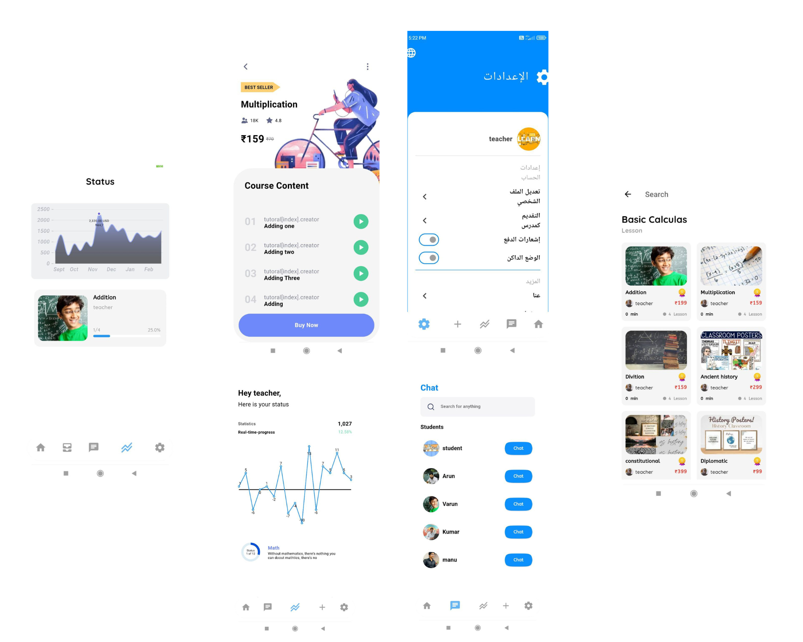

# PATHWAY

Education Platform App

This project is an Education Platform App developed using Flutter for the frontend, Node.js with Express for the backend, and MongoDB for the database. The app provides a comprehensive platform for students to explore courses, interact with mentors, register complaints, and access trending courses.

Amazon store Link: https://www.amazon.com/dp/B0CYB118YT/ref=apps_sf_sta

## Key Features:

#### User Authentication:
Secure user authentication system to protect user data and provide personalized experiences.
Course Exploration:
Users can explore a wide range of courses available on the platform, categorized based on various subjects and topics.

#### Complaint Registration:
Users can register complaints regarding any issues they encounter on the platform, ensuring a seamless user experience.

#### Trending Courses:
Access to trending courses helps users stay updated with popular topics and subjects.

#### Mentor Interaction:
Students can interact with mentors, seek guidance, and participate in discussions to enhance their learning experience.

#### Admin Module:
The admin module allows administrators to manage courses, handle user complaints, and manage user-mentor interactions efficiently.

#### Push Notifications:
Implemented push notification functionality to keep users informed about important updates and announcements.

#### Localization:
Localization support enables users to access the application in multiple languages, enhancing accessibility.

#### Web-Socket:
 Integrated web-socket functionality for real-time communication and interaction between users and mentors.

## Technology Stack:

Frontend: Flutter

Backend: Node.js with Express

Database: MongoDB

Deployment: AWS EC2 server

This project demonstrates the use of REST APIs, MVC architecture, and Bloc pattern for efficient state management. The app aims to provide a seamless learning experience for students while facilitating effective communication between students and mentors.

You can download the app from the Amazon store to explore its features and benefits.

## App Screens

# PATHWAY
